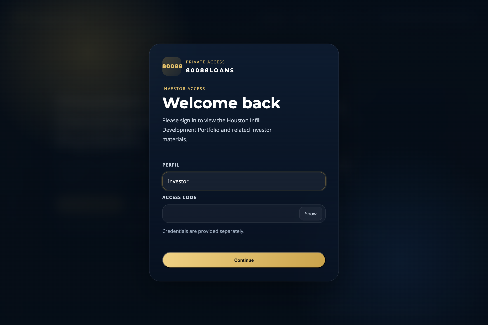
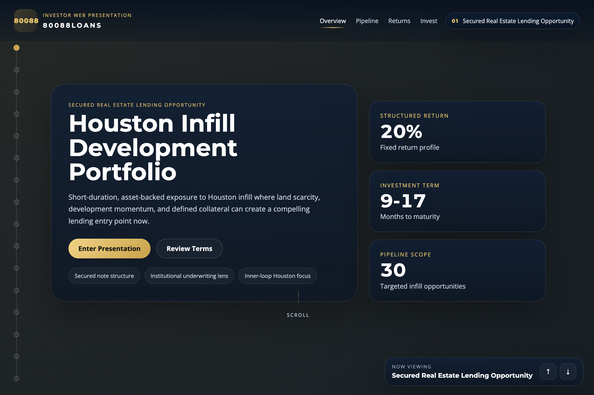
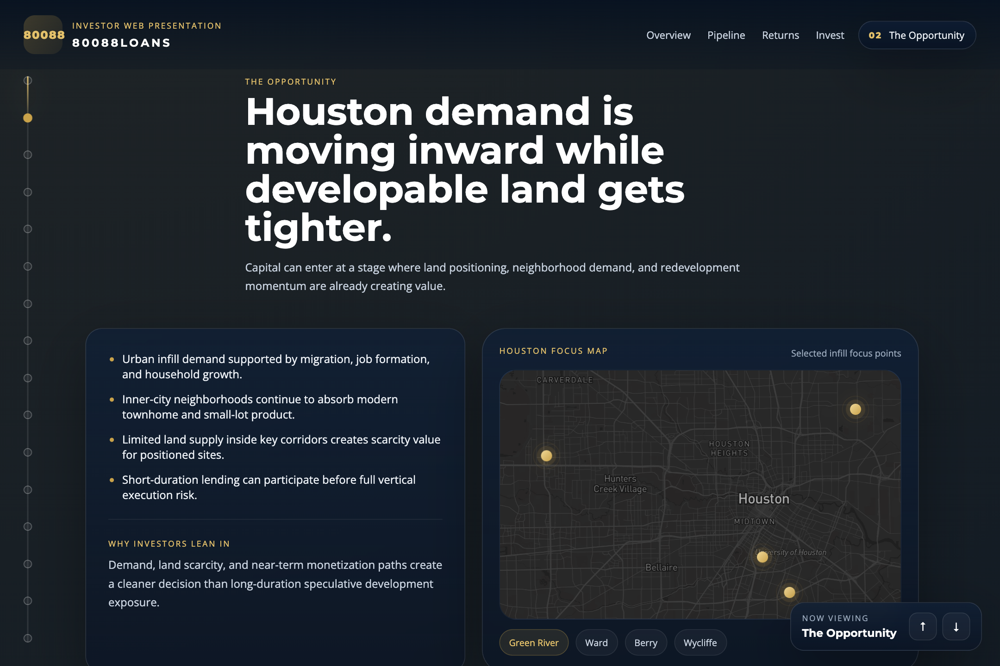
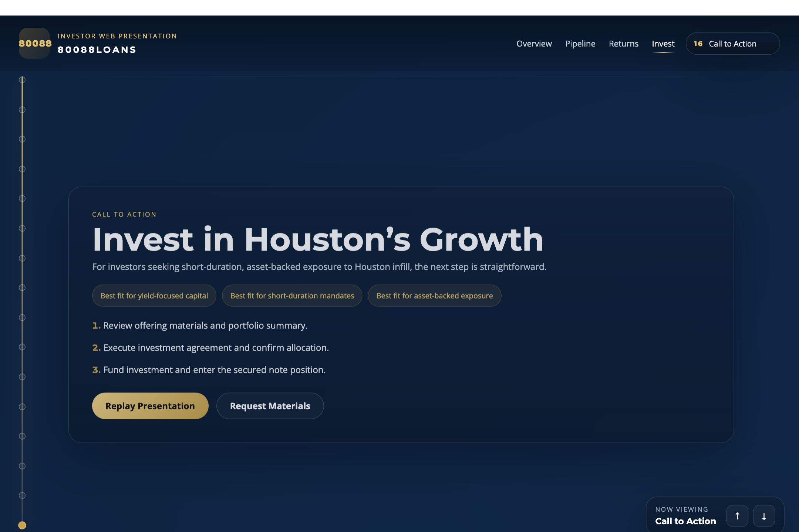

# 80088LOANS

Interactive investor web presentation for a Houston infill real estate lending opportunity.

This project is part product design case study, part front-end execution sample, and part rapid-delivery proof point. It shows how I take a high-stakes business narrative, turn it into a premium web experience, and ship a polished, investor-facing product fast.

## Live Product

- Production: [80088loans.vercel.app](https://80088loans.vercel.app)
- Repository: [villalbajuan-maker/80088LOANS](https://github.com/villalbajuan-maker/80088LOANS)
- Demo access:
  - `Perfil`: `investor`
  - `Access code`: `80088loans`

## What This Project Is

The original ask was not a traditional PowerPoint. The goal was to create a presentation as a web product: cinematic, investor-grade, interactive, mobile-friendly, and fast to iterate.

The end result is a dark institutional one-page experience with:

- investor access flow
- premium landing and slide-style storytelling
- Houston market positioning
- real location intelligence with Mapbox
- pipeline and strike-list framing
- animated metrics and return visuals
- responsive behavior for desktop, iPad, and mobile
- production deployment on Vercel

## The Challenge

This project had a familiar real-world constraint: the business needed something sharp, credible, and presentation-ready very quickly, while the brief was still evolving.

That meant solving more than UI:

- the narrative had to be investor-facing, not internal
- the copy needed to shift from instructions to persuasion
- the product had to balance trust, polish, and speed
- the presentation needed to feel like a premium digital experience, not a long landing page

## What I Contributed

I used this build as a full-stack product sprint, not just a front-end exercise.

- Product direction: reframed the deliverable from "slides" into an interactive web presentation.
- UX: designed the navigation, pacing, mobile behavior, transitions, and access flow.
- Visual design: built a dark institutional visual system with premium motion and strong hierarchy.
- Storytelling: helped shape the investment narrative, slide order, calls to action, and conversion framing.
- Commercial polish: removed internal/instructional language and rewrote the experience for the actual audience.
- Data framing: integrated strike-list material into a more credible pipeline story.
- Mapping: added real Houston geography via Mapbox to increase trust and spatial context.
- Prototype R&D: explored a companion/orb Q&A concept for the presentation.
- Delivery: pushed to GitHub, deployed to Vercel, and iterated live.

## Scope Delivered In Under 24 Hours

This is the kind of rapid product engagement I can take from rough brief to live delivery in less than a day.

Within that turnaround, the project included:

- concept and product reframing
- copy and storytelling support
- front-end implementation
- responsive/mobile hardening
- visual polish and microinteractions
- deployment and production QA
- follow-up iteration passes based on feedback

## Key Product Decisions

### 1. Build it as a web experience, not a deck export

The presentation needed to feel modern, interactive, and easier to refine than a static slide file. Building for the web made it possible to add motion, live navigation, responsive layout, and location-based context.

### 2. Add a premium gated entry

The investor access gate creates a more intentional opening moment and helps the piece feel private, curated, and high-value instead of publicly generic.

### 3. Treat the pause after login as part of the pitch

Instead of a dead transition, the experience briefly frames the opportunity before the user enters the deck. That small moment improves attention and expectation.

### 4. Use real map context only where it adds trust

Mapbox was used in the opportunity layer, where geographic specificity strengthens the story. It was intentionally not spread across every section.

### 5. Keep motion restrained

The animations are there to add confidence and energy, not noise. The goal was premium behavior, not spectacle.

## Screenshots

### Investor access

### Cover experience

### Houston opportunity map

### Call to action

## Tech Stack

- HTML
- CSS
- Vanilla JavaScript
- Mapbox GL JS
- Vercel
- GitHub

## Why This Repo Exists In My Portfolio

This repository is a good example of how I work when a project needs both speed and judgment.

I am not only implementing screens. I am helping shape the product, pressure-test the message, refine the user experience, and ship something that feels intentional under real time pressure.

If you are looking for someone who can turn a rough brief into a high-conviction web deliverable quickly, this project is a good representation of that capability.
